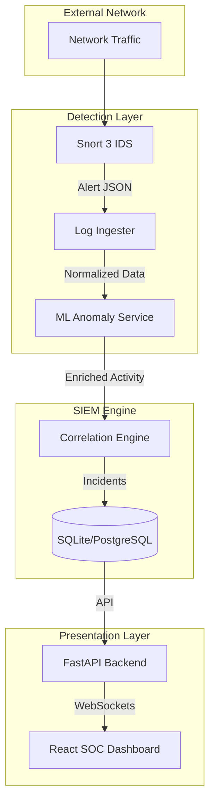

# AegisNet IDS: SOC & SIEM Platform

[](https://www.python.org/)
[](https://reactjs.org/)
[](https://fastapi.tiangolo.com/)

**AegisNet** is a high-performance, intelligent Security Operations Center (SOC) and SIEM platform designed for real-time network threat detection, correlation, and response. By integrating signature-based detection with machine learning and behavioral analysis, AegisNet provides a comprehensive "3-Layer IDS" approach to modern cybersecurity.

---

## 🛡️ Core Pillars: The 3-Layer Integrated IDS

AegisNet operates on a tripartite detection strategy to ensure maximum coverage against both known and unknown threats.

### 1. Signature Layer (Snort 3)
Utilizes industry-standard **Snort 3** to perform deep packet inspection (DPI) against a library of known attack signatures. It provides the first line of defense with high-fidelity alerting.

### 2. Anomaly Layer (ML-Driven)
Leverages unsupervised machine learning (**Isolation Forest**) to detect statistical deviations in network traffic. This layer identifies "living off the land" attacks and zero-day vulnerabilities that bypass signature checks.

### 3. Correlation Layer (Behavioral Analysis)
The internal SIEM engine correlates disparate alerts into unified **Incidents**. By analyzing temporal relationships and IP heuristics, it reduces alert fatigue and identifies complex, multi-stage attack patterns.

---

## 🏗️ System Architecture

AegisNet is built with a decoupled, service-oriented architecture (SOA) to ensure scalability and maintainability.



---

## 🚀 Technical Stack

### Backend & AI
- **Framework**: [FastAPI](https://fastapi.tiangolo.com/) (Asynchronous, High-Performance)
- **Database**: SQLAlchemy with Repository Pattern (PostgreSQL/SQLite)
- **ML/Analytics**: Scikit-Learn (Isolation Forest), Pandas, NumPy
- **Networking**: [Scapy](https://scapy.net/) for custom packet manipulation & simulation

### Frontend (SOC Dashboard)
- **Framework**: [React 19](https://react.dev/) + [Vite](https://vitejs.dev/)
- **Data Management**: [TanStack Query v5](https://tanstack.com/query/latest) & [Zustand](https://zustand-demo.pmnd.rs/)
- **Styling**: Tailwind CSS with a "Premium Dark" aesthetic
- **Visualization**: [Recharts](https://recharts.org/) & Virtualized Incident Tables

---

## 🛠️ Getting Started

### Prerequisites
- **Python 3.10+**
- **Node.js 18+**
- **Snort 3** installed and configured in your environment path.

### Installation

1. **Clone the Repository**
   ```bash
   git clone https://github.com/your-org/AegisNet.git
   cd AegisNet
   ```

2. **Setup Backend**
   ```bash
   python -m venv .venv
   source .venv/bin/activate  # On Windows: .venv\Scripts\activate
   pip install -r requirements.txt
   ```

3. **Setup Frontend**
   ```bash
   cd front-end/AegisNet
   npm install
   ```

4. **Environment Configuration**
   Create a `.env` file in the root and `front-end/AegisNet/` based on the provided examples.

---

## 📊 Key Features

- **Real-Time Streaming**: Instant alert propagation from Snort to the Dashboard via WebSockets.
- **Automated Rule Generation**: A feedback loop that generates Snort rules based on ML-detected anomalies.
- **Threat Intelligence**: Out-of-the-box IP reputation and threat enrichment layers.
- **Elastic Virtualization**: The SOC dashboard handles thousands of events efficiently using `react-window`.
- **SIEM-Grade Persistence**: Implements a full repository pattern for transition between SQLite prototypes and PostgreSQL production clusters.

---

## 🗺️ Roadmap

- [ ] **Phase 5**: Distributed event bus (Kafka integration) for high-scale ingestion.
- [ ] **Phase 6**: SOAR (Security Orchestration, Automation, and Response) integration.
- [ ] **Phase 7**: Multi-tenant support for Managed Security Service Providers (MSSPs).

---

## 📄 License & Credits

Distributed under the MIT License. Developed as a high-fidelity CNS (Cyber Network Security) reference implementation by **OrionGD/AegisNet-IDS**.
